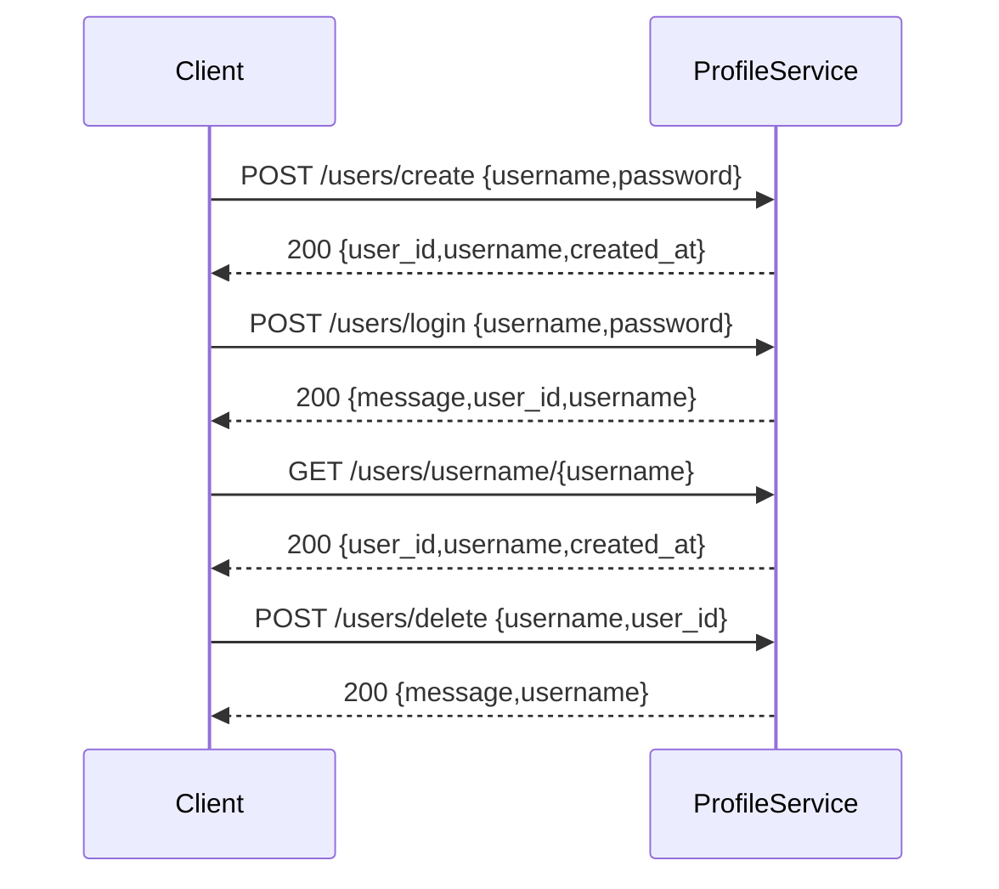

# Profile Management Microservice

This microservice manages user profiles for the Time Tracker project. It provides endpoints to create, authenticate, retrieve, and delete user accounts.

**Base URL (development)**: `http://localhost:8000`

## API Endpoints (Communication Contract)

- `GET /health`
  - Purpose: Health check
  - Request: none
  - Response (200): `{"status": "healthy", "service": "profile_management"}`

- `POST /users/create`
  - Purpose: Create a new user account
  - Request JSON: `{"username": "string", "password": "string"}`
    - `username`: must be unique
    - `password`: minimum 6 characters (service validates)
  - Success Response (200):
    ```json
    {"user_id": "<uuid>", "username": "<username>", "created_at": "<timestamp>"}
    ```
  - Error Responses:
    - 400: `{"detail": "Username already exists"}`
    - 400: `{"detail": "Password must be at least 6 characters long"}`

- `POST /users/login`
  - Purpose: Authenticate a user
  - Request JSON: `{"username": "string", "password": "string"}`
  - Success Response (200):
    ```json
    {"message": "Login successful", "user_id": "<uuid>", "username": "<username>"}
    ```
  - Error Responses:
    - 401: `{"detail": "Invalid password"}`
    - 404: `{"detail": "User not found"}`

- `GET /users/{user_id}`
  - Purpose: Retrieve a user by UUID
  - Request: path param `user_id`
  - Success Response (200):
    ```json
    {"user_id": "<uuid>", "username": "<username>", "created_at": "<timestamp>"}
    ```
  - Error Response: 404 if not found

- `GET /users/username/{username}`
  - Purpose: Retrieve a user by username
  - Request: path param `username`
  - Success Response (200): same as `GET /users/{user_id}`
  - Error Response: 404 if not found

- `POST /users/delete`
  - Purpose: Delete a user account
  - Request JSON: `{"username": "string", "user_id": "<uuid>"}`
    - The service expects both values and will attempt to delete the profile matching the given `user_id`.
  - Success Response (200):
    ```json
    {"message": "Deleted account for user <username>", "username": "<username>"}
    ```
  - Error Responses:
    - 401: `{"detail": "Invalid user_info"}` (when IDs mismatch)
    - 404: `{"detail": "User not found"}`

## How to programmatically REQUEST data (examples)

Examples using Python `requests` (preferred):

Create user example:

```python
import requests

url = "http://localhost:8000/users/create"
payload = {"username": "newuser@example.com", "password": "securepassword123"}
response = requests.post(url, json=payload)
print(response.status_code)
print(response.json())
# On success: {'user_id': '...', 'username': 'newuser@example.com', 'created_at': '...'}
```

Login example:

```python
import requests

url = "http://localhost:8000/users/login"
payload = {"username": "newuser@example.com", "password": "securepassword123"}
response = requests.post(url, json=payload)
print(response.status_code)
print(response.json())
# On success: {'message': 'Login successful', 'user_id': '...', 'username': '...'}
```

Get user by username example:

```python
import requests

url = "http://localhost:8000/users/username/newuser@example.com"
response = requests.get(url)
print(response.status_code)
print(response.json())
# On success: {'user_id': '...', 'username': 'newuser@example.com', 'created_at': '...'}
```

Delete user example (first fetch user_id via username):

```python
import requests

username = "newuser@example.com"
resp = requests.get(f"http://localhost:8000/users/username/{username}")
if resp.status_code != 200:
    print("User not found")
else:
    user_id = resp.json().get("user_id")
    del_resp = requests.post("http://localhost:8000/users/delete", json={"username": username, "user_id": user_id})
    print(del_resp.status_code)
    print(del_resp.json())
```

## How to programmatically RECEIVE and parse data

The service returns standard JSON responses with HTTP status codes indicating success or failure. Example handling in Python:

```python
resp = requests.post("http://localhost:8000/users/create", json=payload)
if resp.status_code == 200:
    data = resp.json()
    user_id = data.get("user_id")
else:
    # error payload uses {'detail': '...'}
    error = resp.json().get("detail")
    print("Error:", error)
```

## UML Sequence Diagram (simple)

Mermaid (renderers that support Mermaid will display this):



ASCII fallback (if Mermaid not rendered):

Client -> ProfileService: POST /users/create {username,password}
ProfileService -> Client: 200 {user_id, username, created_at}

Client -> ProfileService: POST /users/login {username,password}
ProfileService -> Client: 200 {message, user_id, username}

Client -> ProfileService: GET /users/username/{username}
ProfileService -> Client: 200 {user_id, username, created_at}

Client -> ProfileService: POST /users/delete {username, user_id}
ProfileService -> Client: 200 {message, username}

## Notes and Testing

- The server stores profiles in `user_profiles.json` in the same directory; tests may need to remove or reset that file to get a fresh state.
- Passwords are hashed with `bcrypt` before storage; raw passwords are never returned by the API.
- Endpoints validate inputs and return JSON error messages under the `detail` key on failure.

If you want, I can also add a small diagram image file or a more detailed UML diagram in `docs/` and update this README to link it.

